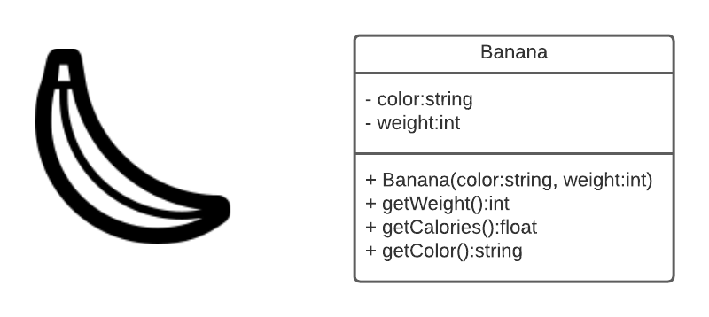
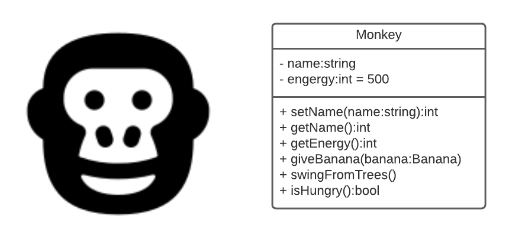

[comment]: <> (Do not remove this!)

**Note that it may take 2-3 minutes for points to update after you push.**

# In Class Encapsulation Exercise 

We'll create two Classes/Objects in class together to illustrate the use of Encapsulation.

There are 50 total points possible in this assignment.

30 points will be auto-graded, with the remaining 20 points given by Prof. Raupach after checking  that your code for all parts followed the good coding practices listed in the rubric and discussed in class.

## Grading rubric 50 points (30 auto-graded)
| Points | Requirements                             |
|--------|------------------------------------------|
| 15     | Banana tests (auto-graded)               |
| 5      | Banana Driver  (manually graded)         |
| 15     | Monkey test suite. (auto-graded)         | 
| 5      | Monkey Driver  (manually graded)         |                 
| 10     | Good coding practices. (manually graded) |

### Style and Efficiency Count

* Separate header (.h) and implementation (.cpp) files for all classes
* All variables should have self-commenting variable names.
* One statement per line, generally each line should also be less than 120 characters
* Proper indenting and spacing
* Each function, class and method should have documenting comments.
* Good descriptive comments for tricky parts of the code.
* You need to make sure your efficiency is as good as the examples we review in class.
* A lack of coding errors like memory leaks

## Banana Class
Create the Banana class as described below. This part of the assignment will consist of 3 c++ files and 1 text file.  There should be a Banana.h header file containing the class definition and a Banana.cpp.  Additionally, you'll create a BananaDriver.cpp to demonstrate all the features of the banana object.  You'll use the BananaDriver as you are developing to test each method as you go. 

Once you're done you can test your code against this automated tests in the test folder to see how your code does against the auto-grader.  I always grade all assignments by hand, the autograder is just there to help. When you're done with the Banana class copy the output of your driver into the DriverOutput/BananaDriver.txt file.  

1. Banana:
    * Properties    
      * color
      * weight
    * Methods
      * getWeight -- Returns the weight
      * getCalories -- Returns the calories
      * getColor -- Returns the color

## Monkey Class
Just like the Banana Class you're going to create a Monkey.h head and Monkey.cpp implementation class.  Create a MonkeyDriver.cpp file to demonstrate all the features of the Monkey object.  When you're done test your code against the automated tests and copy your driver output in the DriverOutput/MonkeyDriver.txt file.   

2. Monkey:
   * Properties:
      * Name
      * energy
   * Methods:
      * setName - gives the monkey a name
      * getName - returns the name of the monkey
      * getEnergy - get the monkeys energy level
      * giveBanana - give the monkey a banana to eat
         * Monkey will only eat yellow bananas
            * Monkey gains energy from the banana’s calories
         * swingFromTrees - uses energy
         * isHungry - checks to see if the monkey is hungry
            * If the monkey’s energy level is low the return true
            * Otherwise, return false